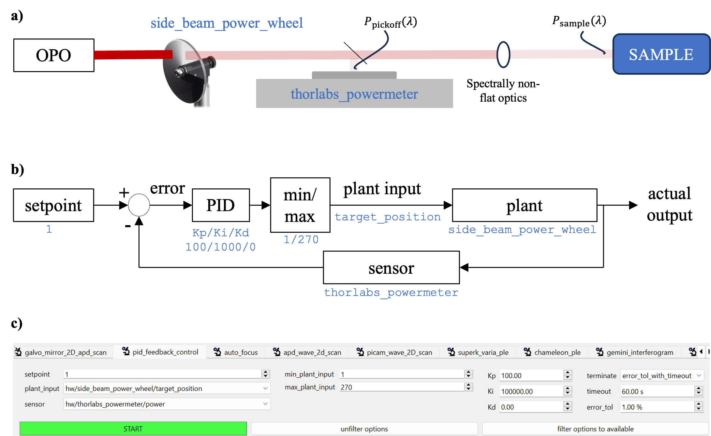

```python
from ScopeFoundry import BaseMicroscopeApp


class FancyApp(BaseMicroscopeApp):

    name = "fancy_app"

    def setup(self):

        from ScopeFoundry.controlling import PIDFeedbackControl
        self.add_measurement(PIDFeedbackControl)
        
        ...

```

add PID measurement to the app (see above) and refere to the following figure to define the control. 





The example illustrates controlling the beam power at a pick-off (measured with `thorlabs_powermeter` as a sensor) by moving a ND density filter wheel (`side_beam_power_wheel` as the plant). The PID controller has the usually 3 parameters. Note that the input to the plant can be constrained by (`min-max_plant_input`).

Note that one set a `terminate` condition.

